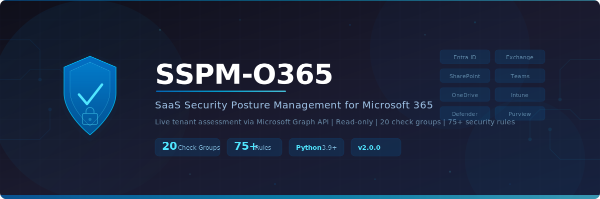

<p align="center">
  
</p>

<p align="center">
  <strong>Open-source SaaS Security Posture Management for Microsoft 365</strong>
</p>

<p align="center">
  <a href="#features"></a>
  <a href="#check-groups"></a>
  <a href="#prerequisites"></a>
  <a href="#compliance-mapping"></a>
  <a href="LICENSE"></a>
  
</p>

---

# SSPM-O365

An open-source, active Python-based SaaS Security Posture Management (SSPM) scanner for Microsoft 365 tenants. Performs **live** security assessments via the Microsoft Graph API across 24 check groups covering Entra ID, Exchange Online, SharePoint, OneDrive, Teams, Intune, Defender, Purview, and more.

## Features

- **24 check groups** with **87+ security rules** across the entire M365 stack
- **Compliance mapping** — every finding mapped to CIS M365 v3.1.0, NIST 800-53, ISO 27001, SOC 2
- **Live API scanning** — connects to your tenant via OAuth 2.0 client credentials
- **Read-only** — requires only `Read` permissions, makes no changes to your tenant
- **Zero dependencies** beyond `requests` — single-file, no agents, no cloud services
- **Multi-format reporting** — terminal, JSON, and self-contained HTML with filters
- **Severity filtering** — focus on CRITICAL/HIGH findings or see everything
- **Exit code** — returns `1` if CRITICAL or HIGH findings exist (CI/CD friendly)

## Check Groups

| # | Category | Rule Prefix | Key Checks |
|---|----------|-------------|------------|
| 1 | Security Baseline | `M365-SEC` | Security Defaults status, CA policy coexistence |
| 2 | Conditional Access | `M365-CA` | MFA enforcement, legacy auth blocking, risky sign-ins, device compliance, location policies |
| 3 | Multi-Factor Authentication | `M365-MFA` | MFA registration gaps, admin MFA, SMS-only MFA, SSPR/MFA mismatch |
| 4 | Privileged Access | `M365-PRIV` | Global Admin count, guest admins, service principal admins, PIM, break-glass accounts |
| 5 | Password Policy | `M365-PWD` | Password expiry, never-expire without MFA, registration campaigns |
| 6 | Application Security | `M365-APP` | High-risk permissions, expired/expiring secrets, certificate vs secret, app sprawl |
| 7 | Guest Access | `M365-GUEST` | Invitation policies, guest-to-guest invites, email-verified join, stale guests |
| 8 | Exchange Online | `M365-EXO` | Notification emails, external forwarding, legacy protocols, SMTP AUTH |
| 9 | SharePoint Online | `M365-SPO` | External sharing, anonymous links, default link type, legacy auth |
| 10 | OneDrive Security | `M365-OD` | Sync restrictions, personal site sharing, departed user retention |
| 11 | Microsoft Teams | `M365-TEAMS` | Anonymous meetings, external federation, guest access |
| 12 | Audit Logging | `M365-AUDIT` | Unified Audit Log, sign-in log retention, mailbox auditing |
| 13 | Identity Protection | `M365-IDP` | High/medium-risk users, sign-in/user risk policies, risky service principals |
| 14 | Secure Score | `M365-SCORE` | Overall score analysis, unresolved high-impact improvement actions |
| 15 | Intune Compliance | `M365-INTUNE` | Compliance policies, platform coverage, non-compliant devices, stale devices |
| 16 | Data Loss Prevention | `M365-DLP` | Sensitivity labels, label coverage, DLP policy verification |
| 17 | Defender for Office 365 | `M365-MDO` | Anti-phishing, Safe Links, Safe Attachments, Zero-hour Auto Purge |
| 18 | Session Security | `M365-SESSION` | Sign-in frequency, persistent browser, token lifetime policies |
| 19 | Cross-Tenant Access | `M365-XTA` | MFA trust, device trust, outbound B2B collaboration |
| 20 | OAuth App Governance | `M365-CONSENT` | User consent, admin consent workflow, unverified publisher apps |
| 21 | Authentication Strengths | `M365-AUTH` | Phishing-resistant MFA enforcement, auth strength in CA, weak methods audit |
| 22 | Entra ID Governance | `M365-GOV` | Access Reviews, privileged role reviews, Entitlement Management packages |
| 23 | Named Locations | `M365-LOC` | Missing locations, overly broad IP ranges, unknown country inclusion |
| 24 | Stale Users | `M365-STALE` | Inactive 90/180-day accounts, never-signed-in users, disabled accounts with roles |

## Compliance Mapping

Every finding is mapped to four compliance frameworks:

| Framework | Standard | Coverage |
|-----------|----------|----------|
| **CIS** | CIS Microsoft 365 Foundations Benchmark v3.1.0 | All 87+ rules |
| **NIST** | NIST SP 800-53 Rev 5 | All 87+ rules |
| **ISO** | ISO/IEC 27001:2022 | All 87+ rules |
| **SOC 2** | Trust Services Criteria (TSC) | All 87+ rules |

Compliance data appears in:
- **Terminal** — `Compliance:` line per finding
- **JSON** — `compliance` object per finding with all 4 frameworks
- **HTML** — CIS M365 column + full compliance detail in expanded row

## Prerequisites

### 1. Python 3.9+

```bash
pip install -r requirements.txt
```

### 2. Entra ID App Registration

1. Go to **Entra ID > App Registrations > New Registration**
2. Name: `SSPM-O365-Scanner` (or any name)
3. Supported account types: **Single tenant**
4. Add a **Client Secret** (Certificates & Secrets > New client secret)
5. Grant the following **Application permissions** (API Permissions > Add > Microsoft Graph > Application):

| Permission | Purpose |
|-----------|---------|
| `Organization.Read.All` | Org settings, security defaults |
| `Policy.Read.All` | Conditional access, auth methods, cross-tenant |
| `Directory.Read.All` | Directory roles, users, groups |
| `User.Read.All` | User sign-in activity, MFA state |
| `AuditLog.Read.All` | Sign-in logs, audit events |
| `IdentityRiskyUser.Read.All` | Risky users, identity protection |
| `Application.Read.All` | App registrations, service principals |
| `RoleManagement.Read.All` | PIM, role assignments |
| `Reports.Read.All` | MFA registration report |
| `UserAuthenticationMethod.Read.All` | Per-user auth methods |
| `PrivilegedAccess.Read.AzureAD` | PIM eligible assignments |
| `SharePointTenantSettings.Read.All` | SharePoint/OneDrive settings |
| `SecurityEvents.Read.All` | Secure Score |
| `DeviceManagementConfiguration.Read.All` | Intune compliance policies |
| `DeviceManagementManagedDevices.Read.All` | Intune managed devices |
| `InformationProtectionPolicy.Read.All` | Sensitivity labels |
| `CrossTenantInformation.ReadBasic.All` | Cross-tenant access settings |
| `AccessReview.Read.All` | Access Reviews (Entra ID Governance) |
| `EntitlementManagement.Read.All` | Entitlement Management packages |

6. **Grant admin consent** for all permissions

## Usage

### Basic scan

```bash
python o365_scanner.py \
    --tenant-id  YOUR_TENANT_ID \
    --client-id  YOUR_CLIENT_ID \
    --client-secret YOUR_SECRET
```

### Environment variables (alternative)

```bash
export M365_TENANT_ID=your-tenant-id
export M365_CLIENT_ID=your-client-id
export M365_CLIENT_SECRET=your-secret
python o365_scanner.py
```

### With reporting options

```bash
# JSON report
python o365_scanner.py -t TENANT -c CLIENT -s SECRET --json report.json

# HTML report (self-contained, dark theme, filterable)
python o365_scanner.py -t TENANT -c CLIENT -s SECRET --html report.html

# Both reports + severity filter
python o365_scanner.py -t TENANT -c CLIENT -s SECRET \
    --json report.json --html report.html --severity HIGH

# Verbose mode (shows API calls and skipped endpoints)
python o365_scanner.py -t TENANT -c CLIENT -s SECRET -v
```

### CLI Options

| Option | Description |
|--------|-------------|
| `--tenant-id`, `-t` | Entra ID tenant ID (GUID) or primary domain |
| `--client-id`, `-c` | App Registration client ID |
| `--client-secret`, `-s` | App Registration client secret |
| `--severity` | Minimum severity: `CRITICAL`, `HIGH`, `MEDIUM`, `LOW` (default: `LOW`) |
| `--json FILE` | Save JSON report to FILE |
| `--html FILE` | Save HTML report to FILE |
| `--verbose`, `-v` | Verbose output |
| `--version` | Show version |

## Output

### Terminal

```
[CRITICAL]  M365-CA-004  No enforced Conditional Access policy requires MFA for all users
  Endpoint : identity/conditionalAccessPolicies
  Context  : MFA for All Users CA policy = not found (enforced)
  CWE      : CWE-308
  Issue    : No active (enforced) CA policy requires MFA for all users...
  Fix      : Create a CA policy: Users = All Users, Grant = Require MFA...
```

### HTML Report

Self-contained dark-themed HTML with:
- Severity chip counters
- Severity and category dropdown filters
- Free-text search
- Expandable issue/fix details per finding

## CI/CD Integration

The scanner exits with code `1` if any CRITICAL or HIGH findings are found, making it suitable for pipeline gates:

```yaml
# GitHub Actions example
- name: M365 SSPM Scan
  run: |
    python o365_scanner.py \
      --tenant-id ${{ secrets.M365_TENANT_ID }} \
      --client-id ${{ secrets.M365_CLIENT_ID }} \
      --client-secret ${{ secrets.M365_CLIENT_SECRET }} \
      --severity HIGH --json sspm-report.json
```

## Architecture

```
o365_scanner.py          # Single-file scanner (~3,770 lines)
├── COMPLIANCE_MAP       # Rule → CIS/NIST/ISO/SOC2 mapping dict
├── Finding              # Data class with auto-enriched compliance
├── O365Scanner          # Main scanner class
│   ├── _authenticate()  # OAuth 2.0 client credentials
│   ├── _graph_get()     # Paginated Graph API helper
│   ├── _check_*()       # 24 check group methods
│   ├── print_report()   # Terminal output with compliance
│   ├── save_json()      # JSON export with compliance
│   └── save_html()      # HTML export with compliance column
└── main()               # CLI entry point (argparse)
```

## License

MIT
